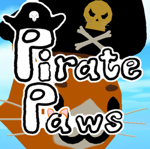
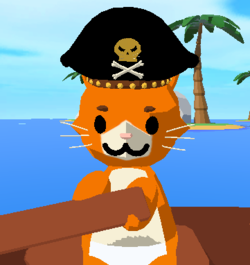
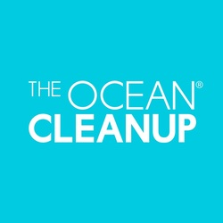
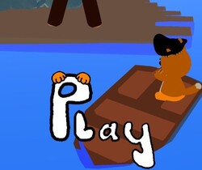

# Pirate Paws

# ❓ What's the game about?

Pirate Paws is a lovely little mobile game designed for kids. It's cartoony style make it fun and rewarding for little kids and teenagers.

# 🌊 The reason behind all of it.
We made the game for the sole purpose to promote [The Ocean Cleanup](https://theoceancleanup.com/).

# Development

It was developed using Unity as a game engine, Blender, Photoshop and Aseprite.

